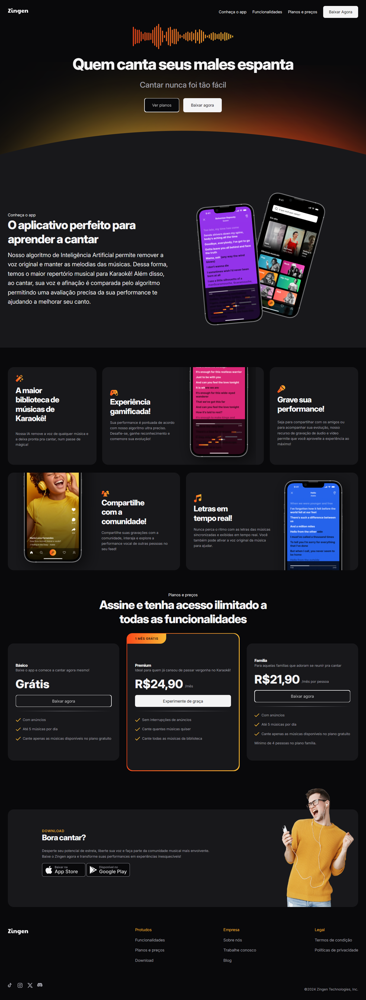
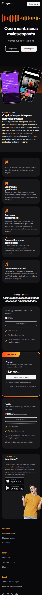

# Zingen | App de Karaoke 🎤

Nesa landing page trabalhei com foco na responsividade de diferentes tamanhos de tela. Um estudo mais aprofundado sobre isso é totalmente necessário, visando uma UX melhor para quem está utilizando não só essa página mas como as outras.

## 📑 Índice

- [Tecnologias Utilizadas](#️-tecnologias-utilizadas)
- [UI](#-ui)
- [Funcionalidades](#️-funcionalidades)
- [Como Rodar o Projeto](#️-como-rodar-o-projeto)
- [Agradecimentos](#️-agradecimentos)

## 🛠️ Tecnologias Utilizadas

### 🔎 Front-end

- **HTML/CSS** - Design do site e responsividade

<p align="center">
  <a href="https://skillicons.dev">
    
  </a>
</p>

## 📷 UI

<div align="center">

### Desktop



### Dispositivo mobile


</div>

## ⚙️ Funcionalidades

- Simula uma landing page de um aplicativo chamado "Zingen". O site é reponsivo por inteiro e atende à telas de celulares.

## 🚀 Como Rodar o Projeto

### Pré-requisitos

- [Node.js](https://nodejs.org/)

### Passos

```bash
- Clone o repositório
    git clone https://github.com/jefolidev/zingen

- Abra a pasta em que você salvou, e execute o arquivo 'index.html'
```

## 👥 Fale comigo!

Achou meu repertório interessante e gostaria de contratar um freela ou talvez me contratar para tornar acrescenter no seu negócio? Entre em contato comigo e vamos marcar.

<p align="center">
  <a href="https://www.linkedin.com/in/jeferson-franco-1349062b0/">
    
  </a>
  <a href="https://github.com/jefolidev">
    
  </a>
</p>
